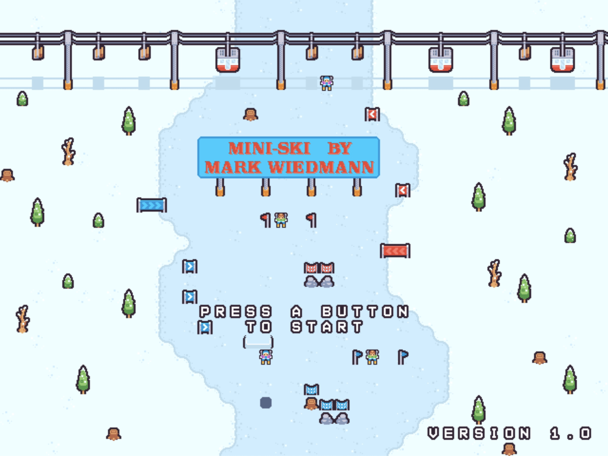

# MINI-SKI for the Commander X16
This is a skiing game for the Commander X16 written in C by Mark Wiedmann. All music and sfx were created by Mark with the [Furnance tracker](https://github.com/tildearrow/furnace). 



## What is the Commander X16
In a nutshell, the CX16 is a new 8-bit system based on the 65c02 processor (popular in many 80s/90s systems like the C64 and NES). It is a spiritual successor to the C64/C128 and even boots into a very similar BASIC prompt. It is NOT compatible with those systems though as the CX16 includes a more advanced graphics/sound chip. The goal is to have a better supported 8-bit system for folks to hack on. There is an emulator for developing on, and actual hardware will be available in the near future.

See [Their FAQ](https://cx16forum.com/faq.html) for more info

## Requirements
- The [cc65](https://cc65.github.io/) cross development package for 65(C)02 systems.
- The Commander X16 emulator. [On the community Github](https://github.com/X16Community/x16-emulator)

## Building
The `build` folder should already contain the latest .prg and all supporting files ready to run.

Building the and running `.prg` file
```
make
``` 
will build the `ski.prg` file which can then be run in the emulator with

```
make run
```
This command executes: `[path-to-emulator]/x16emu -prg ski.prg -run`

`x16emu` is the emulator so use the appropriate path to that executable if it exists elsewhere.

## Level Design
The levels are built using the amazing level editor [LDtk](https://ldtk.io/). The .ldtk file and tileset images are included with this repo. To use the levels in Mini-Ski, I wrote a NodeJS (JavaScript) program to convert the level data into binary files that can be loaded at runtime into the C level structs. You need to regenerate the .bin files after any updates made in LDtk.

To generate the level .bin files:
```
make ldtk
```
This will create a series of .bin files in the `build` folder.

## Tilesets and Sprite Images
I'm using GIMP to make the images for my tilesets and sprites. Mini-Ski runs in 256 color/8bpp mode and I don't read in .png files, so to use images from GIMP they need to be converted to something Mini-Ski can read. The conversion util maps each color to a CX16 palette index and bin image. There are a few steps:

In GIMP:

1. Combine all layers into 1 layer
1. Remove any transparency/alpha from the layer (Layer -> Transparency -> Remove Alpha Channel)
1. "Export" the image and Select "Raw image data" as the file type
1. Save the `.data` file in the `tools` folder

Now convert the `.data` file into a `.bin` file useable in Mini-Ski.

In the `makefile` there is a command `make gimp` to do this.

## Additional Credits
For sound/music I use the awesome ZSMKit by MooingLemur which licensed under an MIT license (https://github.com/mooinglemur/zsmkit).

ZSMKit is mainly designed to be used in Assembly, so to use ZSMKit in C, I borrowed some code and the cx16.cfg from Toboter's amazing game [Vault of the Vindicator](https://codeberg.org/Toboter/VaultOfTheVindicator).

## License
See the [license file](./license.md)
